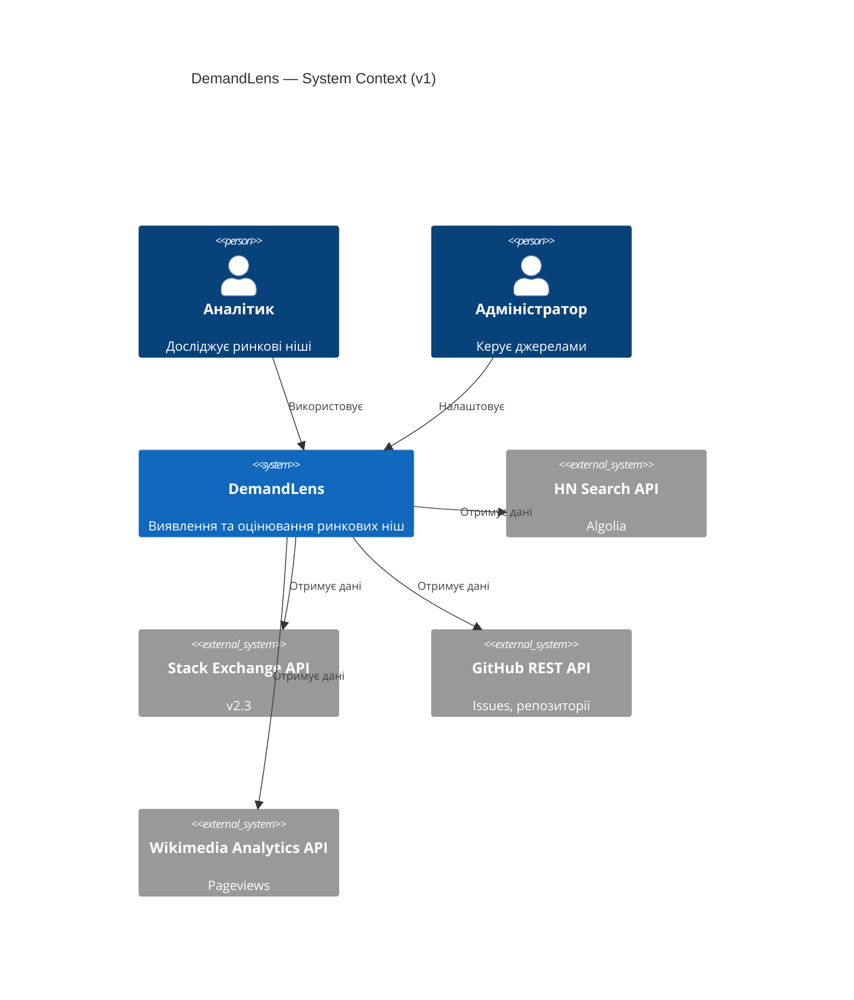
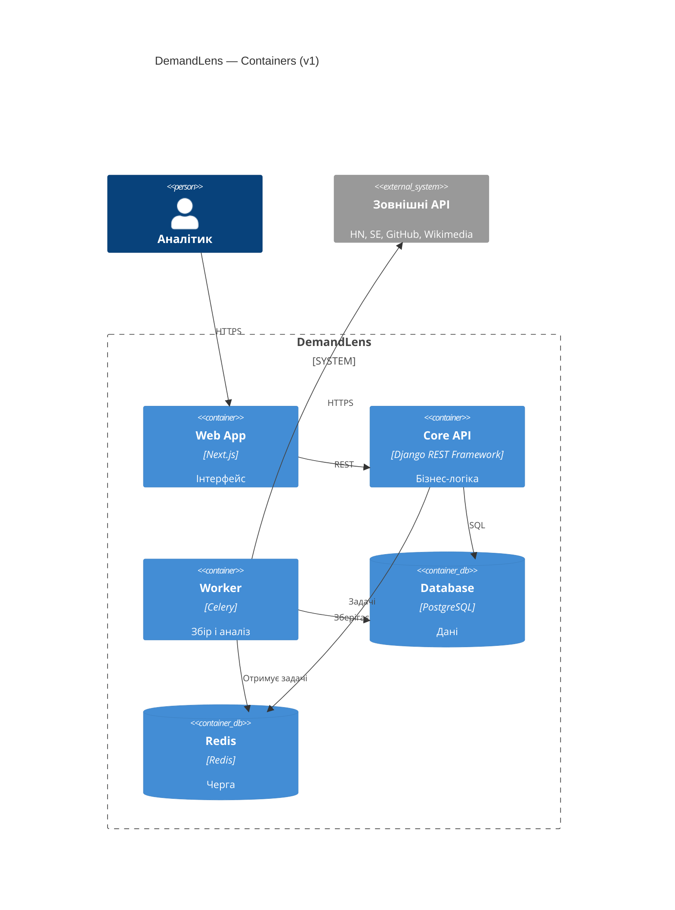
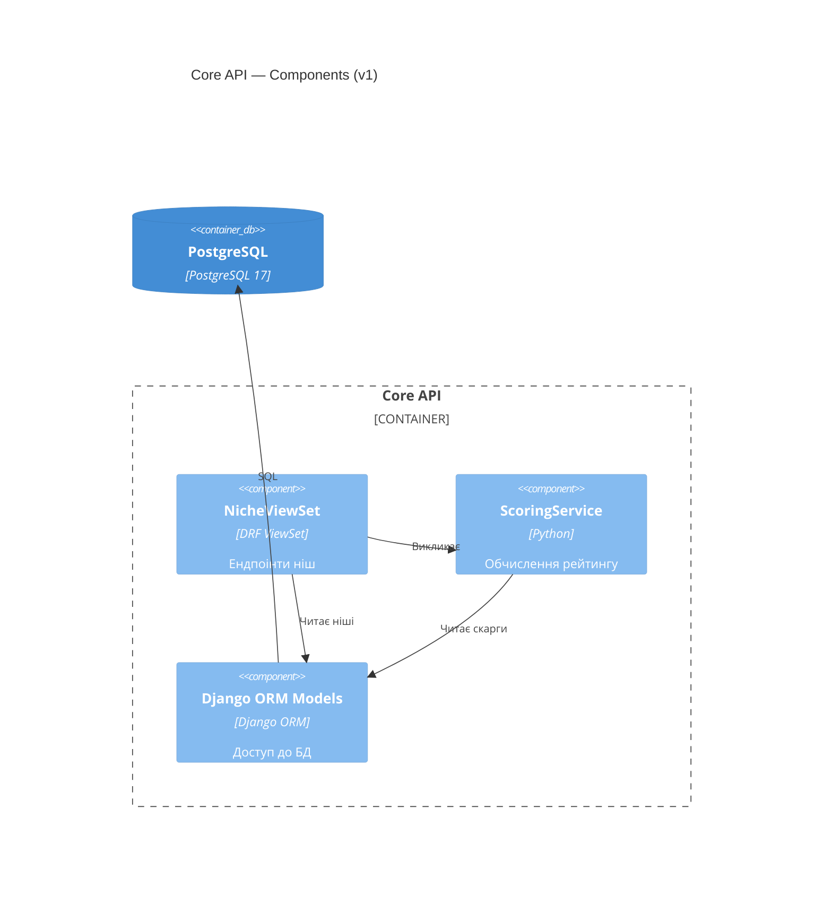

# Перша версія діаграм C4 (до рев'ю)

Чернетка зафіксована для протоколу AI Insights; фінальна версія — `docs/2_design.md`.

## L1 v1

```mermaid
C4Context
    title DemandLens — System Context (v1)
    Person(analyst, "Аналітик", "Досліджує ринкові ніші")
    Person(admin, "Адміністратор", "Керує джерелами")
    System(dl, "DemandLens", "Виявлення та оцінювання ринкових ніш")
    System_Ext(hn, "HN Search API", "Algolia")
    System_Ext(se, "Stack Exchange API", "v2.3")
    System_Ext(gh, "GitHub REST API", "Issues, репозиторії")
    System_Ext(wm, "Wikimedia Analytics API", "Pageviews")
    Rel(analyst, dl, "Використовує")
    Rel(admin, dl, "Налаштовує")
    Rel(dl, hn, "Отримує дані")
    Rel(dl, se, "Отримує дані")
    Rel(dl, gh, "Отримує дані")
    Rel(dl, wm, "Отримує дані")
```

## L2 v1

```mermaid
C4Container
    title DemandLens — Containers (v1)
    Person(analyst, "Аналітик")
    System_Boundary(dl, "DemandLens") {
        Container(web, "Web App", "Next.js", "Інтерфейс")
        Container(api, "Core API", "Django REST Framework", "Бізнес-логіка")
        Container(worker, "Worker", "Celery", "Збір і аналіз")
        ContainerDb(db, "Database", "PostgreSQL", "Дані")
        ContainerDb(redis, "Redis", "Redis", "Черга")
    }
    System_Ext(src, "Зовнішні API", "HN, SE, GitHub, Wikimedia")
    Rel(analyst, web, "HTTPS")
    Rel(web, api, "REST")
    Rel(api, db, "SQL")
    Rel(api, redis, "Задачі")
    Rel(worker, redis, "Отримує задачі")
    Rel(worker, db, "Зберігає")
    Rel(worker, src, "HTTPS")
```

## L3 v1 (Core API)

```mermaid
C4Component
    title Core API — Components (v1)
    Container_Boundary(api, "Core API") {
        Component(views, "NicheViewSet", "DRF ViewSet", "Ендпоінти ніш")
        Component(svc, "ScoringService", "Python", "Обчислення рейтингу")
        Component(orm, "Django ORM Models", "Django ORM", "Доступ до БД")
    }
    ContainerDb(db, "PostgreSQL", "PostgreSQL 17")
    Rel(views, orm, "Читає ніші")
    Rel(views, svc, "Викликає")
    Rel(svc, orm, "Читає скарги")
    Rel(orm, db, "SQL")
```
